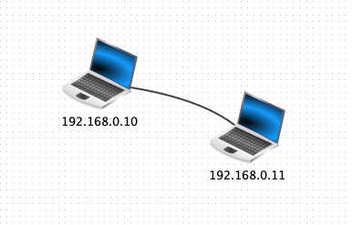
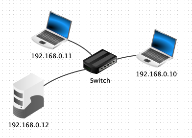
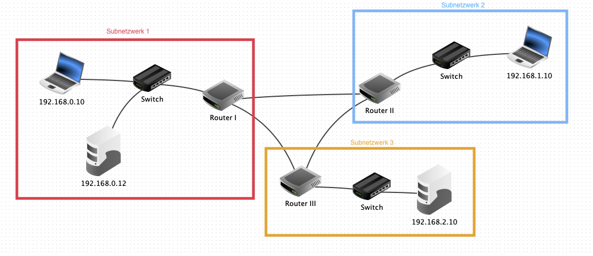

# Wie funktionieren Rechnernetzwerke?

Jeder hat schon einmal mit dem Internet gearbeitet.
Das Internet ist dieses große Netzwerk aus Millionen von Computern, die unter einander Daten austauschen.
Aber wie funktioniert so ein großes Netzwerk eigentlich?
Ist jeder mit jedem verbunden? Gibt es Verteil-Stellen?

## Von Anfang an

Als Sir Tim Berners-Lee 1989 das Internet erfunden hat, wollte er eigentlich ein deutlich kleineres Problem lösen:
Alle Rechner im CERN sollten so verbunden werden, dass sie untereinander kommunizieren konnten.

Wie kommunizieren eigentlich zwei Rechner untereinander?

Verbindet man zwei Computer mit einem sogenannten Twisted-Pairs-Kabel, können sie mit einander kommunizieren.
Man vergibt dann an beide Geräte jeweils eine IP-Addresse, die diese Geräte identifizieren.
Möchte der linke Rechner nun also den rechten erreichen, so sendet er einfach an die IP-Addresse `192.168.0.11`, dieser kann dann an `192.168.0.10` antworten.

## Mehr Rechner

Möchte man mehr als zwei Rechner verbinden, benötigt man ein Vermittlungsgerät - einen "Switch".
Einen Switch kann man sich vorstellen wie eine Mehrfachsteckdose.
Kommt bei ihm eine Nachricht an, so leitet er sie einfach an alle angeschlossenen Geräte weiter.

Möchte `192.168.0.10` nun also an `192.168.0.12` schicken, so erhält auch `192.168.0.11` die Nachricht, ignoriert sie aber weil die Addresse nicht mit seiner übereinstimmt.

## Subnetze

Möchte man nun mehr Computer zusammenschließen, könnte man sicher einen größeren Switch bauen.
Das wird aber schnell unpraktikabel, da nun jeder Rechner einen Haufen Nachrichten erhält, die ihn nicht betreffen.

Um das zu verhindern und gewisse Bereiche des Netzwerks abzukapseln, kann man Subnetze bilden.

Auffällig ist: Wir haben jetzt drei Subnetze mit jeweils einem Router, die nur über die Router mit einander verbunden sind.

### Was ist ein Router eigentlich?
Gäbe es eine deutsche Übersetzung für "Router", so wäre sie vermutlich "Verteiler".
Die Aufgabe des Routers ist, alle ankommenden Nachrichten an das passende nächste Gerät weiterzuleiten.
Man kann eine Parallele zum Switch ziehen: Währen der Switch eingehende Nachrichten "dumm" an alle anderen weiterleitet, entscheidet der Router "schlau", welches Gerät auf der Route zum Ziel liegt.
Der *Router* bestimmt die beste *Route* zum Ziel.

Möchte ein Client nun also eine Nachricht an ein Gerät in einem anderen Subnetz schicken, so versieht er die Nachricht mit der Ziel-Addresse, schickt das Paket aber erst einmal an den Router.
Die Addresse des nächsten Routers nennt man "Gateway" und wird auf dem Rechner konfiguriert.

Nun erhält der Router die Nachricht und will herausfinden, an welches Gerät er diese schicken muss.
Dafür hat er sogenannte Routing-Tabellen:

| Ziel        | Nächstes Gerät |
| ----------- | -------------- |
| 192.168.1.0 | 1.0.0.1        |
| 192.168.2.0 | 2.0.0.1        |

Mit einer sogenannten *Netzmaske*, was das genau ist erkläre ich später, findet der Router nun die passende Addresse heraus.

Soll ein Paket an `192.168.2.43` gehen, wäre das nächste Gerät nach dieser Tabelle `2.0.0.1`.

In dem im Bild zu sehenden Netzaufbau würde das bedeuten:
Möchte ein Rechner aus Subnetzwerk 1 einen Rechner in Subnetzwerk 3 erreichen, gehen die Pakete über Router I und Router III.

## DHCP

Bis jetzt müssen wir alle IP-Addressen, Gateways und Routing-Tabellen selbst festlegen.
Bei einer großen Anzahl auf Geräten wird das schnell zur Sysyphus-Arbeit.

Um das zu automatisieren, gibt es das **D**ynamic **H**ost **C**onfiguration **P**rotocol.
Man lässt auf einem Server einfach einen DHCP-Server laufen und gibt jedem Gerät die Addresse dieses Servers.
Nun vergibt der DHCP-Server automatisch eine IP-Addresse, wenn ein Gerät diese anfragt.

## Subnetzmasken

Eine IP-Addresse ist eine Zahl der Länge 32 Bit, die meistens als Kombination aus vier 8-Bit-Zahlen dargestellt wird.
In ihr sind zwei Informationen enthalten: Die Addresse des Zielgerätes, sowie die Addresse des Netzwerkes, in dem es sich befindet.

In Heimnetzwerken sind meistens die ersten drei Elemente (`192.168.0.***`) der Netzwerk-Teil, das letzte Element wird als *Geräte-Teil* bezeichnet.
In größeren Netzwerken, zum Beispiel einem Firmennetzwerk oder dem Internet, sind das oft nicht genug IP-Addressen für alle Geräte - der Geräte-Teil muss also größer werden.
Hier könnte man zum Beispiel `192.168.***.***` verwenden: Nun gibt es $2^16$ verschiedene IPs für Geräte.

Wie wird bestimmt, welcher Teil Geräte- und welcher Netzwer-Teil ist?
Dafür verwendet man die bereits angedeutete *Subnetzmaske*.
Sie ist eine weitere 32-Bit-Zahl, die durch logische Verknüpfungen die Teile ergibt.

### Netzwerkteil

Den Netzwerkteil erhält man durch eine logische *Und*-Verknüpfung der IP-Addresse mit der Subnetzmaske.

$$
192.168.12.23 \land 255.255.0.0 = 192.168.0.0
$$

### Geräteteil

Den Geräteteil erhält man durch eine logische *Und*-Verknüpfung der IP-Addresse mit der *invertierten* Subnetzmaske.

$$
192.168.12.23 \land 0.0.255.255 = 0.0.12.23 = 12.23
$$

### Besondere Addressen

Im Netzwerk sind zwei Addressen reserviert:

Die erste Addresse des Netzwerks ist das *Standard-Gateway*.
In unserem Beispiel-Netzwerk ist sie `192.168.0.1`.

Die letze Addresse des Netzwerks ist der *Broadcast*
In unserem Beispiel-Netzwerk ist sie `192.168.255.255`.
Sendet man ein Paket an den *Broadcast*, so werden sie an alle Geräte im Netzwerk verteilt.u

## Wofür kann man das jetzt benutzen?

Rechnernetzwerke können für viele verschiedene Anwendungszwecke eingesetzt werden.
Aus dem Alltag sind sie nicht mehr wegzudenken:
Email, World-Wide-Web, IRC und vieles mehr sind allumfassend.
Auch beim Bau von großen Rechner-Clustern oder Supercomputern ist eine Netzwerkverbindung unabdingbar.

Letztendlich können einfache Heimnetzwerke durch Plug'n'Play-WLAN-Router von jedem erstellt werden.
Das Wissen um die dahinterliegenden Konzepte und Protokolle kann aber nützlich werden, wenn es doch mal zu Problemen kommt.
Außerdem ist es mit diesem Hintergrundwissen deutlich einfacher, das moderne Internet zu durchschauen.

Hoffentlich hilft dir diese kurze Einführung in Netzwerke ein wenig!
Schau dich gerne auch mal im Rest des Blogs um, vielleicht findest du ja noch etwas anderes interessantes.
