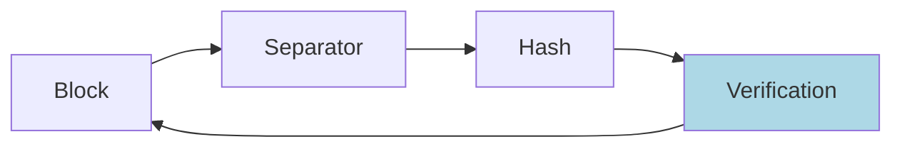

# Translation
`.`: Kurz  
`-`: Lang  

## Values

A: `---`  
B: `--.-`  
C: `--.`  
D: `.--`  
E: `.`  
F: `---.`  
G: `....`  
H: `.-.`  
I: `...`  
J: `...--`  
K: `.-.-`  
L: `-.-`  
M: `.-..`  
N: `..`  
O: `.-.-.`  
P: `...-`  
Q: `----`  
R: `--`  
S: `-`  
T: `.-`  
U: `-..`  
V: `--..`  
W: `..--`  
X: `-..-`  
Y: `.--.`  
Z: `-...`  
Leer: `-..-`  

# Control Sequences:

**Hash**

* am Ende die ersten vier **Buchstaben** (Zahlen werden ignoriert, da wir keine Symbole dafür haben) des md5-Hashes des (klein geschriebenen) Blocks am Ende anhängen.
* Trenner: `.....`

**Antwort des Empfängers**

Verification:  
Ja: `.`  
Nein: `-`  

* bei _Nein_: erneutes Senden des Blockes

# Beispiel:
Gold Gefunden:
`... .-.-. -.- .-- -..- .... . ---. -.. .. .-- . .. ..... . . --. --.`